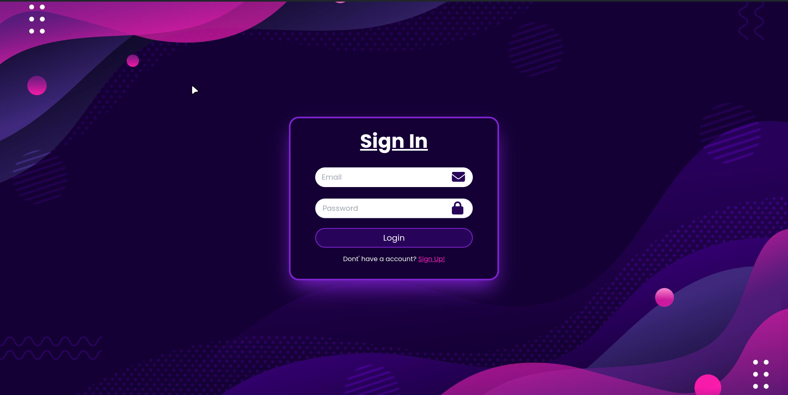
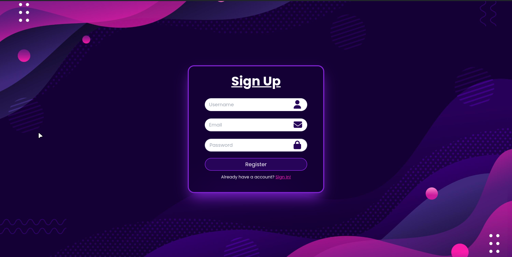
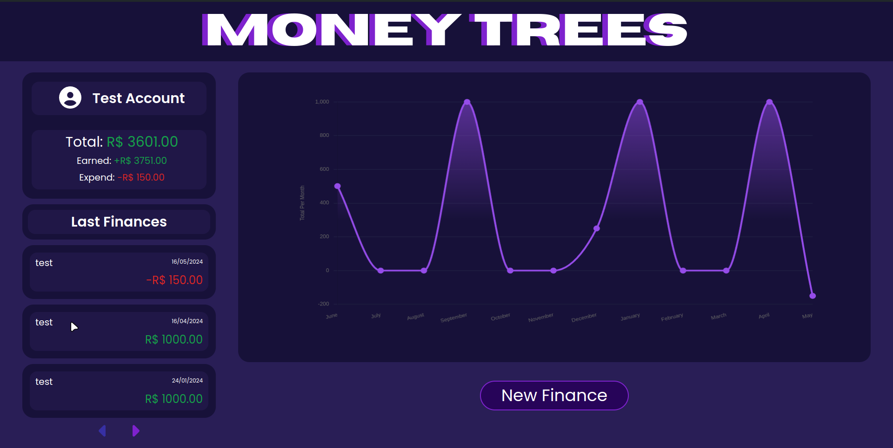
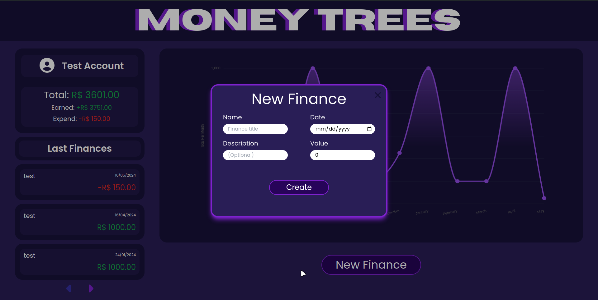
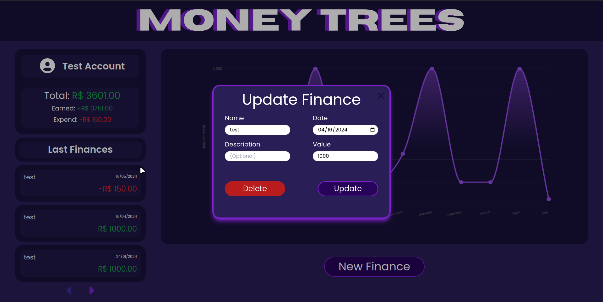
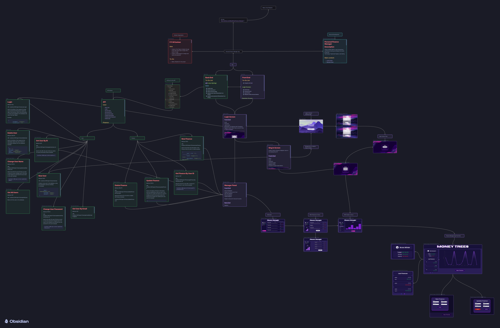

 

## 📖 Descrição
- Projeto Full Stack, utilizando Java Spring, Angular e PostgreSQL.
- Gerenciador de Finanças com Gráfico.
- REST API
- WebSite
- Interface para criar, alterar, deletar e visualizar finanças.
- Extras: TailwinCSS, FontAwsome, Chart.js

## 📷 Galeria

### Tela de Login

### Tela de Registro

### Tela do App

### Cadastrar nova Finança

### Atualizar Finança

## 💻 Instalação

### Pré-requisitos
- Node
- Angular 17
- JDK 22
- PostgresSQL 16

## 📝 Aprendizados

- Kanban
- Agile Scrum 
- Diagramas 
- WorkFlow
- Angular
- TypeScript
- TailwindCSS 
- Chart.js - Grafico
- FontAwsome - Icones
- Angular Material - Dialogs
- Git - Versionamento com multiplas branchs
- Github - Repositorio remoto
- Java
- Spring
- CRUD
- REST API 
- Session Storage
- RouteGuards
- Postman 
- PostgreSQL

## 📈 Workflow

## 🚀 Futuras Atualizações

Este projeto poderá ser atualizado, com algumas metas:

- [ ] Melhoria no Gráfico
- [ ] Criar Popup para Alterar Nome e Senha do Usuário
- [ ] Adicionar Novas Funcionalidades

## 🤖 Tecnologias
